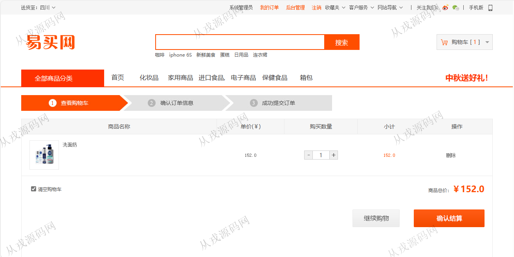
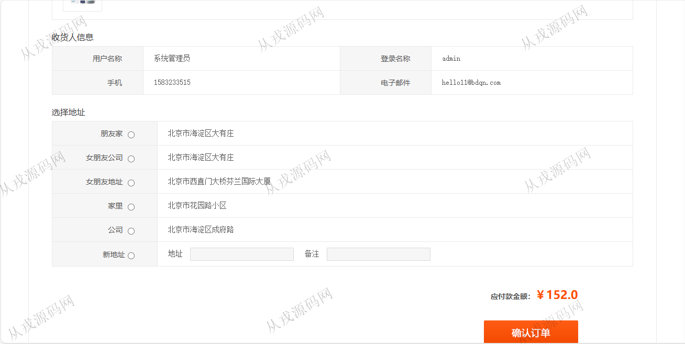
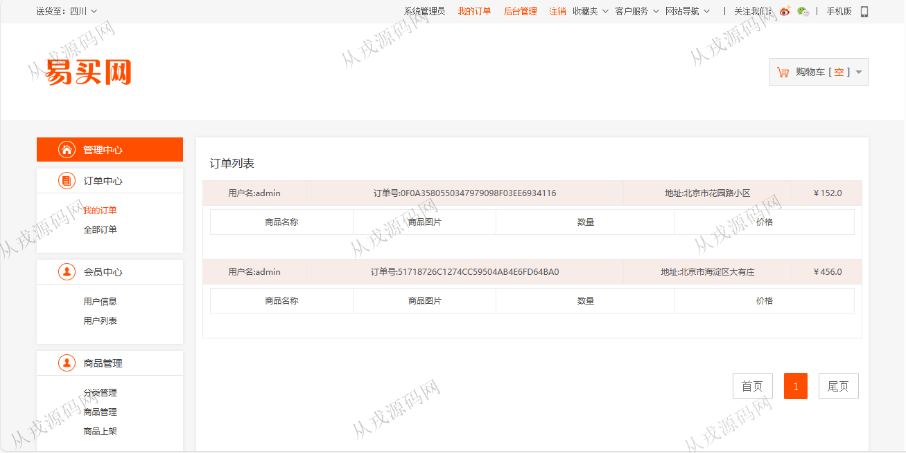
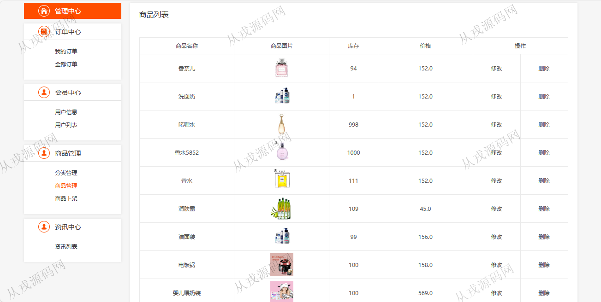
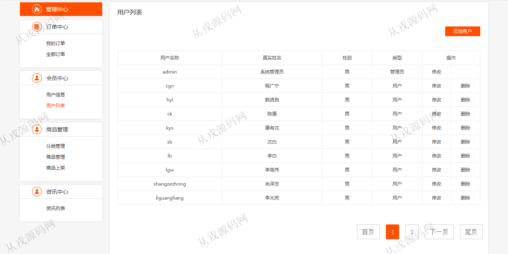

<h1 align="center">191.网上购物商城管理系统</h1>

- <b>完整代码获取地址：从戎源码网 ([https://armycodes.com/](https://armycodes.com/))</b>
- <b>技术探讨、资料分享，请加QQ群：692619798</b> 
- <b>作者微信：19941326836  QQ：952045282</b> 
- <b>承接计算机毕业设计、Java毕业设计、Python毕业设计、深度学习、机器学习</b>
- <b>选题+开题报告+任务书+程序定制+安装调试+论文+答辩ppt 一条龙服务</b>
- <b>所有选题地址 ([https://github.com/YuLin-Coder/AllProjectCatalog](https://github.com/YuLin-Coder/AllProjectCatalog)) </b>

## 项目介绍
基于java+jsp的网上购物商城管理系统：前端 jsp、jquery，后端 servlet、jdbc；角色分为管理员、用户；集成商品浏览、购物车、在线结算、订单查询、商品发布等功能于一体的系统。

## 功能介绍

- 基本功能：登录，注册，退出
- 网站首页：全局搜索，主导航栏，分类导航，轮播图，热门商品展示，限时特卖，新闻资讯
- 商品购买：商品列表展示，商品详情，购物车，在线结算，填写收货地址
- 订单中心：订单列表查询
- 用户列表：用户信息的增删改查，也可以由用户自行注册
- 分类管理：分类信息的增删改查
- 商品管理：商品信息的增删改查，商品图片上传
- 资讯列表：资讯信息的列表查询，资讯详情

## 环境

- <b>IntelliJ IDEA 2021.3</b>

- <b>Mysql 5.7.26</b>

- <b>Tomcat 7.0.73</b>

- <b>JDK 1.8</b>

## 运行截图

